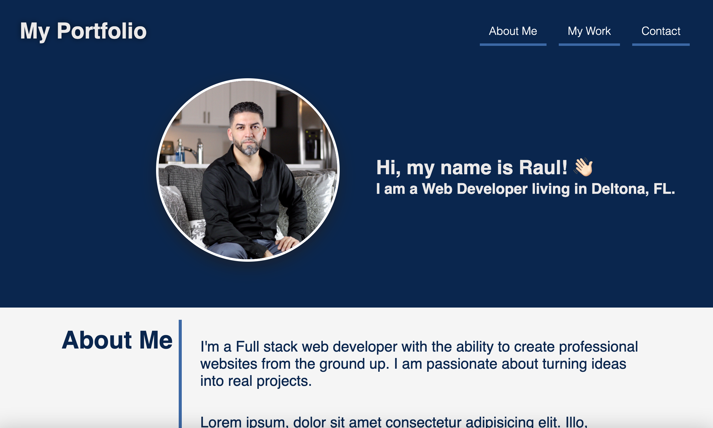

# MyPortfolio

My Personal Portfolio

## Description

 Challenge 2 is a portfolio website to showcase my skills and projects. It is a single page website that is built using HTML, CSS. It is a responsive website that is built using flexbox.

## Screenshot

## Mockup

## Deployment

* Deployed Application: &nbsp; [Live URL](https://jimenezraul.github.io/MyPortfolio/)